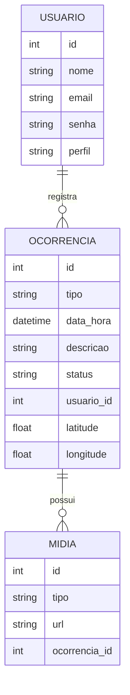

# Projeto Integrador: App para Coleta e Gestão de Ocorrências - CBMPE

## Visão Geral do Projeto

[cite_start]O projeto foca no desenvolvimento de um aplicativo para a coleta e gestão de dados de ocorrências em campo para o Corpo de Bombeiros Militar de Pernambuco (CBMPE)[cite: 15].

[cite_start]A solução é composta por um aplicativo móvel multiplataforma (Android/IOS/PWA) e um painel administrativo web[cite: 16]. As principais funcionalidades incluem:
* [cite_start]Registro padronizado e em tempo real das ocorrências, com funcionamento offline[cite: 17].
* [cite_start]Captura de fotos, vídeos, localização GPS e assinaturas digitais[cite: 18].
* [cite_start]Integração com o banco de dados central do CBMPE para análises e estatísticas[cite: 19].
* [cite_start]Acompanhamento das ocorrências em tempo real[cite: 20].
* [cite_start]Exportação de dados para relatórios e sistemas internos[cite: 21].

[cite_start]O impacto esperado é a melhoria na precisão e rapidez dos registros, redução de erros, maior eficiência operacional e alinhamento com as diretrizes de transformação digital do Governo de Pernambuco[cite: 22].

---

## Cronograma de Entregas

* [cite_start]**Primeira Entrega:** 08/10/2025 (Web App - Plataforma de Gestão e Análise) [cite: 23, 24]
* [cite_start]**Segunda Entrega:** 03/12/2025 (Mobile App - App Para Registro e Consulta) [cite: 27, 28]

---

## Features do Projeto

### Painel Web (Admin/Estatísticas)
* **W-01 | [cite_start]Login & Perfis (admin, analista, chefe) - M1** [cite: 38]
    * [cite_start]**Aceitação:** Perfis distintos limitam o acesso a dados e funcionalidades[cite: 39].
* **W-02 | [cite_start]Lista & Filtros de Ocorrências - M2** [cite: 40]
    * [cite_start]**Aceitação:** Permite filtrar por período, tipo, região, status e possui paginação[cite: 41].
* **W-03 | [cite_start]Visualização de Detalhes - M2** [cite: 42, 43]
    * [cite_start]**Aceitação:** Exibe todos os campos, mídias, localização, timeline e permite baixar anexos[cite: 44].
* **W-04 | [cite_start]Relatórios Básicos & Exportação (CSV/PDF) - M2** [cite: 45]
    * [cite_start]**Aceitação:** Gera e exporta relatórios com métricas selecionadas[cite: 46].
* **W-05 | [cite_start]Gestão de Usuários - M2** [cite: 47, 48]
    * [cite_start]**Aceitação:** CRUD de usuários, redefinição de senha e vinculação de perfis[cite: 49].
* **W-06 | [cite_start]Auditoria & Logs - M2** [cite: 50]
    * [cite_start]**Aceitação:** Rastreia as ações dos usuários com filtros por evento[cite: 51].
* **W-07 | [cite_start]Dashboard Operacional (KPI simples) - M2** [cite: 52]
    * [cite_start]**Aceitação:** Apresenta cards e gráficos de ocorrências por tipo, região e turno[cite: 53].
* **W-08 | [cite_start]Catálogo/Form Builder (campos configuráveis) - Futuro** [cite: 54]
    * [cite_start]**Aceitação:** Permite criar ou alterar campos de formulário sem a necessidade de reempacotar o aplicativo[cite: 55].

### App de Campo (Mobile)
* **F-01 | [cite_start]Autenticação & Perfis (operador, chefe, admin) - M1** [cite: 62]
    * [cite_start]**Descrição:** Login com credenciais institucionais, bloqueio por tentativas e logout[cite: 63].
* **F-02 | [cite_start]Registro de Ocorrência (formulário padrão) - M1** [cite: 65]
    * [cite_start]**Descrição:** Formulário com campos obrigatórios (tipo, data/hora, viatura, equipe, descrição) e opcionais[cite: 66].
* **F-03 | [cite_start]Modo Offline (cache + fila de sincronização) - M1** [cite: 69]
    * [cite_start]**Descrição:** Armazena ocorrências localmente e sincroniza ao restabelecer a conexão[cite: 71].
* **F-04 | [cite_start]Captura GPS (geolocalização no ato) - M1** [cite: 74]
    * [cite_start]**Descrição:** Obtém coordenadas, precisão e carimbo de data/hora[cite: 75].
* **F-05 | [cite_start]Captura de Foto - M1** [cite: 77]
    * [cite_start]**Descrição:** Tira fotos a partir do aplicativo, com compressão e metadados[cite: 78].
* **F-06 | [cite_start]Assinatura Digital (vitimado/testemunha) - M1** [cite: 81]
    * [cite_start]**Descrição:** Coleta de assinatura na tela, vinculada ao registro da ocorrência[cite: 82].
* **F-07 | [cite_start]Validações de Formulário - M1** [cite: 84]
    * [cite_start]**Descrição:** Validação para campos obrigatórios, máscaras (CPF/telefone), ranges e formatos[cite: 85].
* **F-08 | [cite_start]Lista de Ocorrências (meus registros) - M1** [cite: 87]
    * [cite_start]**Descrição:** Tela que lista as ocorrências do usuário com status (sincronizado/pendente)[cite: 88].
* **F-09 | [cite_start]Edição Antes do Envio - M1** [cite: 90]
    * [cite_start]**Descrição:** Permite editar registros que estão pendentes de sincronização[cite: 91].
* **F-10 | [cite_start]Captura de Vídeo - M2** [cite: 99, 100]
    * [cite_start]**Descrição:** Gravação de vídeos curtos com compressão e limite de tamanho[cite: 101].
* **F-11 | [cite_start]Sincronização com Resolução de Conflitos - M2** [cite: 103]
    * [cite_start]**Descrição:** Utiliza a estratégia "last-write-wins" com log e alerta o usuário em caso de conflitos[cite: 104].
* **F-12 | [cite_start]Linha do Tempo da Ocorrência - M2** [cite: 107, 108]
    * [cite_start]**Descrição:** Apresenta todos os eventos da ocorrência em ordem cronológica[cite: 110].
* **F-13 | [cite_start]Mapa In-App (pontos de ocorrência) - M2** [cite: 112]
    * [cite_start]**Descrição:** Visualização em mapa das ocorrências do turno do usuário[cite: 113].
* **F-14 | [cite_start]Push Notifications (atualização/atribuição) - M2** [cite: 115]
    * [cite_start]**Descrição:** Notifica sobre novas atribuições ou alterações de status[cite: 116].
* **F-15 | [cite_start]Acessibilidade - M2** [cite: 118]
    * [cite_start]**Descrição:** Inclui alto contraste, fontes escaláveis e leitura por voz[cite: 119].
* **F-16 | [cite_start]Modo Treinamento (sandbox) - Futuro** [cite: 122]
    * [cite_start]**Descrição:** Ambiente simulado para capacitação, sem afetar dados reais[cite: 124].
* **F-17 | [cite_start]Escaneio de QR/Barcodes (equipamentos) - Futuro** [cite: 126]
    * [cite_start]**Descrição:** Permite vincular recursos e equipamentos à ocorrência[cite: 127].

---

## Detalhes das Entregas

### [cite_start]**Entrega 1 (08/10/2025): PWA + API + Hardware + Backend** [cite: 133]
* [cite_start]Protótipo funcional do PWA para registro de ocorrências (formulários básicos e modo offline)[cite: 134].
* [cite_start]Primeira versão da API REST integrada ao banco de dados[cite: 135].
* [cite_start]Integração inicial com hardware (GPS, câmera, assinatura digital)[cite: 136].
* [cite_start]Estrutura de backend para autenticação e armazenamento de dados[cite: 137].
* [cite_start]Relatório técnico inicial com a arquitetura do sistema e fluxo de dados[cite: 138].

### [cite_start]**Entrega 2 (03/12/2025): React Native + Backend CRUD + Hardware** [cite: 143]
* [cite_start]Aplicativo em React Native com funcionalidades avançadas (fotos, vídeos, assinaturas)[cite: 145].
* [cite_start]Implementação completa do CRUD de ocorrências e usuários no backend[cite: 146].
* [cite_start]Integração plena com hardware (GPS em tempo real, câmera, armazenamento offline)[cite: 147].
* [cite_start]Painel web administrativo com relatórios estatísticos e exportação de dados[cite: 148].
* [cite_start]Testes de usabilidade e validação com militares do CBMPE[cite: 148].

## Critérios de Avaliação

| Critério                                                                   | [cite_start]Entrega 1 (08/10) [cite: 154] | [cite_start]Entrega 2 (03/12) [cite: 154] |

## Sistema de Avaliação

* **1ª Avaliação:**
    * [cite_start]Presença + Atividades/Listas (40% da nota)[cite: 163].
    * [cite_start]Projeto + Apresentação (60% da nota)[cite: 164].
    * [cite_start]Avaliação 360[cite: 165].
* **2ª Avaliação:**
    * [cite_start]Presença + Atividades/Listas (40% da nota)[cite: 167].
    * [cite_start]Projeto + Apresentação (60% da nota)[cite: 168].
    * [cite_start]Avaliação 360[cite: 169].
* **Final:**
    * [cite_start]Avaliação Teórica (100% da nota)[cite: 171].

# CBMPE - Coleta e Gestão de Ocorrências

## Documentação da API

### Autenticação
- `POST /api/login`  
  Autentica usuário.  
  **Body:** `{ usuario, senha }`  
  **Retorno:** `{ token }`

### Usuários
- `GET /api/usuarios`  
  Lista usuários.
- `POST /api/usuarios`  
  Cria usuário.
- `PUT /api/usuarios/:id`  
  Atualiza usuário.
- `DELETE /api/usuarios/:id`  
  Remove usuário.

### Ocorrências
- `GET /api/ocorrencias`  
  Lista ocorrências (filtros: tipo, data, status).
- `POST /api/ocorrencias`  
  Cria ocorrência.
- `GET /api/ocorrencias/:id`  
  Detalhes da ocorrência.
- `PUT /api/ocorrencias/:id`  
  Atualiza ocorrência.
- `DELETE /api/ocorrencias/:id`  
  Remove ocorrência.

### Mídias
- `POST /api/ocorrencias/:id/midia`  
  Adiciona foto/vídeo à ocorrência.
- `GET /api/ocorrencias/:id/midia`  
  Lista mídias da ocorrência.

### Relatórios
- `GET /api/relatorios`  
  Exporta dados (CSV/PDF).

---

## Modelo de Dados (Mermaid)

