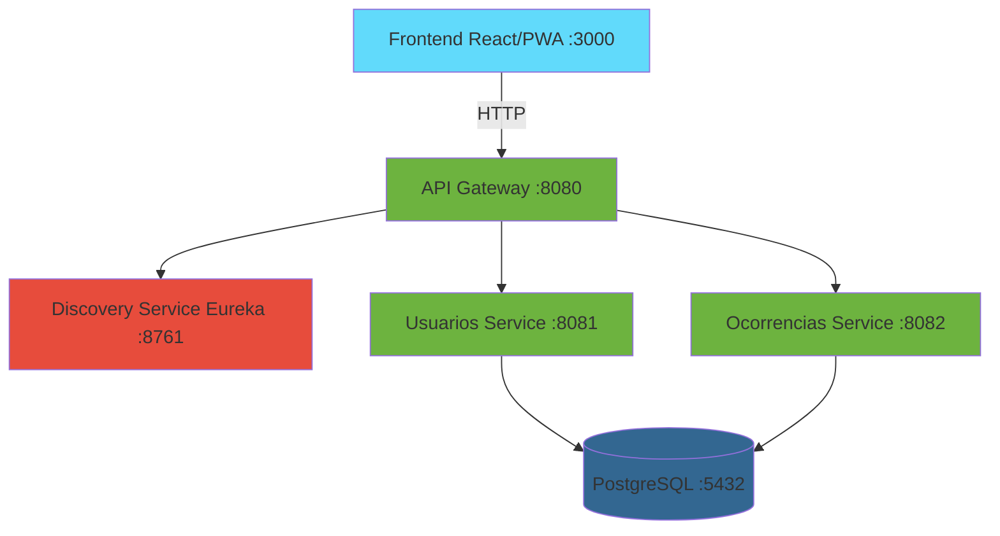
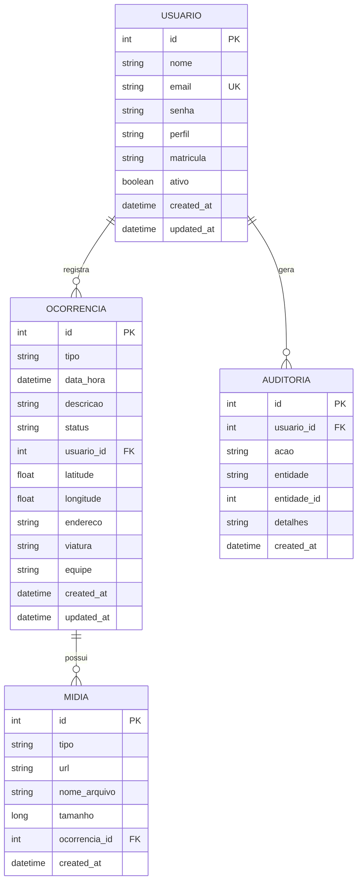

# 🚒 Sistema de Gestão de Ocorrências - CBMPE

Sistema para coleta e gestão de dados de ocorrências em campo para o Corpo de Bombeiros Militar de Pernambuco (CBMPE).

---

## 📖 Sobre o Projeto

Aplicativo para registro e gestão de ocorrências do CBMPE, composto por:

- **Aplicativo móvel multiplataforma** (Android/iOS/PWA)
- **Painel administrativo web**
- **API REST com microserviços**

### Tecnologias

* **Backend:** Java 21, Spring Boot 3.2.0, Spring Cloud
* **Database:** PostgreSQL 16

* **Infraestrutura:** Docker, Docker Compose, Eureka


### ✨ Funcionalidades

### Painel Web (Admin/Estatísticas)

- **Login & Perfis** - Controle de acesso (admin, analista, chefe)
- **Lista & Filtros de Ocorrências** - Busca por período, tipo, região, status com paginação
- **Visualização de Detalhes** - Campos completos, mídias, localização e timeline
- **Relatórios & Exportação** - Geração e exportação em CSV/PDF
- **Gestão de Usuários** - CRUD completo e redefinição de senha
- **Auditoria & Logs** - Rastreamento de ações dos usuários
- **Dashboard Operacional** - KPIs com gráficos por tipo, região e turno

### App de Campo (Mobile)

- **Autenticação & Perfis** - Login institucional com bloqueio por tentativas
- **Registro de Ocorrência** - Formulário padronizado com validações
- **Modo Offline** - Cache local com sincronização automática
- **Captura GPS** - Geolocalização em tempo real
- **Captura de Foto/Vídeo** - Com compressão e metadados
- **Assinatura Digital** - Coleta de assinaturas de envolvidos
- **Lista de Ocorrências** - Visualização dos registros com status de sincronização
- **Edição Offline** - Edição de registros pendentes
- **Sincronização com Conflitos** - Resolução automática (last-write-wins)
- **Linha do Tempo** - Histórico de eventos da ocorrência
- **Mapa In-App** - Visualização de ocorrências no mapa
- **Push Notifications** - Alertas de novas atribuições

---

## 🚀 Como Rodar o Projeto

### Pré-requisitos

- Java 21+
- Maven 3.8+
- Docker & Docker Compose
- Git

### Instalação

1. **Clone o repositório**

```bash
git clone https://github.com/seu-usuario/lobo-bombeiros.git
cd lobo-bombeiros
```

2. **Configure o arquivo `.env`**

```env
POSTGRES_DB=cbmpe_db
POSTGRES_USER=cbmpe_user
POSTGRES_PASSWORD=sua_senha

JWT_SECRET=sua_chave_jwt_secreta

SPRING_MAIL_HOST=smtp.gmail.com
SPRING_MAIL_PORT=587
SPRING_MAIL_USERNAME=seu_email@gmail.com
SPRING_MAIL_PASSWORD=sua_senha_app
```

3. **Build do projeto**

```bash
mvn clean package -DskipTests
```

4. **Inicie os serviços**

```bash
docker-compose up -d
```

5. **Verificar status**

```bash
docker-compose ps
```

### Acessar os Serviços


| Serviço                   | URL                                   | Descrição              |
| -------------------------- | ------------------------------------- | ------------------------ |
| **API Gateway**            | http://localhost:8080                 | Entrada principal da API |
| **Eureka Dashboard**       | http://localhost:8761                 | Service Discovery        |
| **Usuários Service**      | http://localhost:8081                 | Gestão de usuários     |
| **Ocorrências Service**   | http://localhost:8082                 | Gestão de ocorrências  |
| **Swagger (Usuários)**    | http://localhost:8081/swagger-ui.html | Documentação API       |
| **Swagger (Ocorrências)** | http://localhost:8082/swagger-ui.html | Documentação API       |

### Comandos Úteis

```bash
# Ver logs
docker-compose logs -f usuarios-service

# Parar serviços
docker-compose down

# Rebuild após alterações
docker-compose up -d --build usuarios-service

# Limpar dados (remove volumes)
docker-compose down -v
```

### Executar Localmente (sem Docker)

```bash
# 1. PostgreSQL
docker run -d --name postgres-cbmpe \
  -e POSTGRES_DB=cbmpe_db \
  -e POSTGRES_USER=cbmpe_user \
  -e POSTGRES_PASSWORD=senha \
  -p 5432:5432 postgres:16

# 2. Discovery Service
cd discovery-service && mvn spring-boot:run

# 3. Usuarios Service
cd usuarios-service && mvn spring-boot:run

# 4. Ocorrencias Service
cd ocorrencias-service && mvn spring-boot:run

# 5. API Gateway
cd api-gateway && mvn spring-boot:run
```

---

## 📊 Arquitetura e Modelo de Dados

### Arquitetura de Microserviços



### Modelo de Dados



---

## 📝 API Endpoints

### Autenticação

```bash
POST /auth/login              # Login
POST /auth/register           # Cadastro
POST /auth/refresh            # Renovar token
```

### Usuários

```bash
GET    /usuarios              # Listar usuários
POST   /usuarios              # Criar usuário
GET    /usuarios/{id}         # Buscar por ID
PUT    /usuarios/{id}         # Atualizar
DELETE /usuarios/{id}         # Deletar
POST   /usuarios/solicitar-redefinicao-senha
POST   /usuarios/redefinir-senha
```

### Ocorrências

```bash
GET    /ocorrencias           # Listar (filtros: tipo, data, status)
POST   /ocorrencias           # Criar
GET    /ocorrencias/{id}      # Buscar por ID
PUT    /ocorrencias/{id}      # Atualizar
DELETE /ocorrencias/{id}      # Deletar
POST   /ocorrencias/{id}/midia     # Adicionar mídia
GET    /ocorrencias/{id}/midia     # Listar mídias
```

### Relatórios

```bash
GET    /relatorios            # Exportar (CSV/PDF)
```

---

## 🔧 Configuração CORS

O backend está configurado para aceitar requisições do frontend em:

- `http://localhost:3000`
- `http://127.0.0.1:3000`

---

## 👥 Equipe

Projeto Integrador - Faculdade SENAC Pernambuco

</div>
